# EYD Gateway Platform - Architecture & Implementation Guide

## Table of Contents
1. [Project Overview](#project-overview)
2. [System Architecture](#system-architecture)
3. [User Roles & Permissions](#user-roles--permissions)
4. [Implementation Journey](#implementation-journey)
5. [Technical Stack](#technical-stack)
6. [Database Schema](#database-schema)
7. [User Management System](#user-management-system)
8. [Setup Guide](#setup-guide)
9. [API Endpoints](#api-endpoints)
10. [Security Considerations](#security-considerations)
11. [Troubleshooting](#troubleshooting)

## Project Overview

The EYD Gateway Platform is a comprehensive user management system built with ASP.NET Core 9.0 that provides hierarchical access control for different user roles in an educational/organizational context.

### Core Purpose
- Manage users across different roles (Superuser, Admin, TPD/Dean, ES, EYD)
- Provide hierarchical permission system
- Handle user assignments to Areas and Schemes
- Secure user authentication and authorization

## System Architecture

### Hierarchical Permission Model
```
Superuser (Full System Access)
    ├── Can manage all users including Admins
    ├── Full CRUD on Areas and Schemes
    └── System-wide administrative privileges
    
Admin (Limited Management Access)
    ├── Can manage TPD/Dean, ES, and EYD users only
    ├── Cannot manage other Admins or Superusers
    └── Limited to specific user role management

TPD/Dean, ES, EYD (Operational Users)
    ├── Role-specific dashboards
    ├── Limited to their assigned Areas/Schemes
    └── Cannot manage other users
```

### Application Flow

```mermaid
graph TD
    A[User Login] --> B{Authentication}
    B -->|Success| C{Role Check}
    B -->|Failure| D[Login Page]
    
    C -->|Superuser| E[Superuser Dashboard]
    C -->|Admin| F[Admin Dashboard]
    C -->|TPD/Dean| G[TPD Dashboard]
    C -->|ES| H[ES Dashboard]
    C -->|EYD| I[EYD Dashboard]
    
    E --> J[Manage All Users]
    F --> K[Manage TPD/ES/EYD Users]
    
    J --> L[User Details Editing]
    J --> M[Assignment Management]
    K --> L
    K --> M
```


## User Roles & Permissions

### Superuser
- **Full Access**: Can view, edit, create, and delete all users
- **User Management**: Can edit personal details (name, email, password) of all users
- **Assignment Management**: Can assign/reassign roles, areas, and schemes for all users
- **System Administration**: Full access to all system features

### Admin
- **Limited Access**: Can only manage TPD/Dean, ES, and EYD users
- **User Management**: Can edit personal details of non-admin users
- **Assignment Management**: Can assign/reassign roles, areas, and schemes for permitted users
- **Restrictions**: Cannot view or modify other Admins or Superusers

### Operational Users (TPD/Dean, ES, EYD)
- **Enhanced TPD/Dean View-Only Access**: 
  - Can view all schemes within their assigned area (dropdown selection)
  - Can view EYD users in any scheme within their area
  - Can search for EYD users across all areas using exact username/GDC number
- **Security Boundaries**: Area-restricted for scheme viewing, search-only for cross-area access
- **Dashboard Access**: Role-specific functionality with new interactive features
- **No Management**: Cannot manage other users or modify assignments
- **Restricted Permissions**: EYD assignment functionality is Admin-only

## Implementation Journey

### Phase 1: Initial Setup & Error Resolution
**Challenge**: Application had compilation errors when running Superuser functionality
**Solution**: 
- Fixed missing using statements
- Resolved method signature issues
- Corrected view model references

### Phase 2: Hierarchical Permission System
**Requirements**: "Both superuser and admin users should have the ability to edit TPD/Dean, ES and EYD users. (super user can edit admin account)"

**Implementation Approach**:
1. **Shared Controller Strategy**: Used SuperuserController for both Superuser and Admin roles
2. **Permission Filtering**: Implemented role-based filtering in controller methods
3. **Conditional UI**: Added role-based view rendering
4. **AdminController Redirection**: Redirected Admin methods to SuperuserController

**Key Decisions**:
- Single source of truth for user management logic
- Centralized permission validation
- Maintainable codebase with shared functionality

### Phase 3: User Details Editing System
**Challenge**: "The superuser and admin currently from what I can see is not able to edit the details of the user, i.e name/email/password. that function is needed still"

**Solution Architecture**:
1. **Separation of Concerns**: 
   - User Details editing (name, email, password)
   - Assignment management (roles, areas, schemes)

2. **Implementation Components**:
   - `EditUserDetailsViewModel` for form data
   - `EditUserDetails` GET/POST methods in SuperuserController
   - Dedicated view with comprehensive form
   - Password reset functionality using ASP.NET Core Identity

3. **UI Enhancement**:
   - Renamed "Edit" to "Assignments" for clarity
   - Added "Details" button for personal information editing
   - Role-based button visibility

## Technical Stack

### Backend
- **Framework**: ASP.NET Core 9.0
- **Authentication**: ASP.NET Core Identity
- **Database**: Entity Framework Core with SQLite
- **Architecture**: MVC Pattern

### Frontend
- **UI Framework**: Bootstrap 5
- **Icons**: Font Awesome
- **JavaScript**: Vanilla JS for dynamic interactions
- **Styling**: Custom CSS with Bootstrap theming

### Development Tools
- **IDE**: Visual Studio Code
- **Version Control**: Git
- **Package Manager**: NuGet

## Database Schema

### Core Entities

#### ApplicationUser (ASP.NET Identity Extended)
```csharp
public class ApplicationUser : IdentityUser
{
    public string DisplayName { get; set; }
    public string Role { get; set; }
    public int? AreaId { get; set; }
    public Area? Area { get; set; }
    public int? SchemeId { get; set; }
    public Scheme? Scheme { get; set; }
}
```

#### Area
```csharp
public class Area
{
    public int Id { get; set; }
    public string Name { get; set; }
    public ICollection<Scheme> Schemes { get; set; }
}
```

#### Scheme
```csharp
public class Scheme
{
    public int Id { get; set; }
    public string Name { get; set; }
    public int AreaId { get; set; }
    public Area Area { get; set; }
}
```

### Relationships
- Users can be assigned to one Area and one Scheme
- Areas contain multiple Schemes
- Schemes belong to one Area

## User Management System

### Core Features

#### 1. User Details Editing
**Location**: `/Superuser/EditUserDetails/{userId}`
**Permissions**: 
- Superuser: All users
- Admin: TPD/Dean, ES, EYD users only

**Functionality**:
- Edit first name, last name, display name
- Update email address
- Optional password reset
- Role-based permission validation

#### 2. Assignment Management
**Location**: `/Superuser/ManageUsers` (via modal)
**Permissions**: Role-based access control

**Functionality**:
- Assign/reassign user roles
- Set Area and Scheme assignments
- Remove assignments
- Bulk user management

#### 3. User Creation
**Location**: `/Superuser/CreateNewUser`
**Features**:
- Create users with initial role assignment
- Set initial Area/Scheme assignments
- Generate secure passwords
- Email notifications (configurable)

### ViewModels

#### EditUserDetailsViewModel
```csharp
public class EditUserDetailsViewModel
{
    public string UserId { get; set; }
    public string FirstName { get; set; }
    public string LastName { get; set; }
    public string DisplayName { get; set; }
    public string Email { get; set; }
    public string CurrentRole { get; set; }
    public bool ChangePassword { get; set; }
    public string? NewPassword { get; set; }
    public string? ConfirmPassword { get; set; }
}
```

#### SuperuserUserManagementViewModel
```csharp
public class SuperuserUserManagementViewModel
{
    public List<UserDetailsViewModel> Users { get; set; }
    public List<Area> Areas { get; set; }
    public List<Scheme> Schemes { get; set; }
}
```

## Setup Guide

### Prerequisites
- .NET 9.0 SDK
- Visual Studio Code or Visual Studio
- SQLite (included with EF Core)

### Installation Steps

1. **Clone Repository**
   ```bash
   git clone <repository-url>
   cd EYDGateway
   ```

2. **Restore Dependencies**
   ```bash
   dotnet restore
   ```

3. **Database Setup**
   ```bash
   dotnet ef database update
   ```

4. **Run Application**
   ```bash
   dotnet run
   ```

5. **Access Application**
   - Navigate to `http://localhost:5252`
   - Default Superuser: admin/admin123

### Configuration

#### Database Connection
**File**: `appsettings.json`
```json
{
  "ConnectionStrings": {
    "DefaultConnection": "Data Source=app.db"
  }
}
```

#### Identity Configuration
**File**: `Program.cs`
```csharp
builder.Services.AddDefaultIdentity<ApplicationUser>(options => 
{
    options.SignIn.RequireConfirmedAccount = false;
    options.Password.RequireDigit = true;
    options.Password.RequiredLength = 6;
})
.AddEntityFrameworkStores<ApplicationDbContext>();
```

## API Endpoints

### Authentication
- `GET /Account/Login` - Login page
- `POST /Account/Login` - Process login
- `POST /Account/Logout` - Logout user

### User Management (Superuser/Admin)
- `GET /Superuser/ManageUsers` - User management dashboard
- `GET /Superuser/EditUserDetails/{userId}` - Edit user details form
- `POST /Superuser/EditUserDetails` - Process user details update
- `POST /Superuser/ReassignUser` - Update user assignments
- `POST /Superuser/RemoveUserAssignment` - Remove user assignments
- `GET /Superuser/CreateNewUser` - New user form
- `POST /Superuser/CreateNewUser` - Create new user

### Role-Specific Dashboards
- `GET /Superuser/Dashboard` - Superuser dashboard
- `GET /Admin/Dashboard` - Admin dashboard
- `GET /TPD/Dashboard` - TPD dashboard with enhanced functionality
- `POST /TPD/ViewSchemeEYDs` - View EYD users in selected scheme (area-restricted)
- `POST /TPD/SearchEYD` - Search EYD users across all areas (exact match only)
- `GET /ES/Dashboard` - ES dashboard
- `GET /EYD/Dashboard` - EYD dashboard

## Security Considerations

### Authentication & Authorization
- ASP.NET Core Identity for secure authentication
- Role-based authorization with `[Authorize(Roles = "...")]`
- Hierarchical permission validation in controllers

### Data Protection
- Password hashing via Identity framework
- Secure session management
- CSRF protection on all forms

### Input Validation
- Model validation with data annotations
- XSS prevention through Razor encoding
- SQL injection prevention via Entity Framework

### Permission Validation
```csharp
// Example permission check
private bool CanEditUser(string currentUserRole, string targetUserRole)
{
    if (currentUserRole == "Superuser") return true;
    if (currentUserRole == "Admin")
        return targetUserRole != "Admin" && targetUserRole != "Superuser";
    return false;
}
```

## Troubleshooting

### Common Issues

#### 1. TPD/Dean Login Returns 401 Unauthorized
**Problem**: TPD or Dean users get 401 error when accessing dashboard
**Root Cause**: Role inconsistency - controllers checking for "TPD/Dean" but database uses separate "TPD" and "Dean" roles
**Solution**: 
- Fixed TPDController to accept both "TPD" and "Dean" roles
- Updated ESController role filtering logic
- Corrected view styling for separate roles
- Ensured database seeding uses consistent role names

#### 2. TPD Dashboard Shows "No Assigned Area or Managed Schemes"
**Problem**: TPD dashboard displays no area or schemes despite successful login
**Root Cause**: Assignment model mismatch - TPDs are assigned to Schemes directly, but controller expected Area assignments
**Database Schema**: 
- TPDs: `SchemeId` = assigned scheme, `AreaId` = null
- EYDs: `SchemeId` = assigned scheme, `AreaId` = null  
- Admin/ES: `AreaId` = assigned area, `SchemeId` = null
**Solution**:
- Updated TPDController to use `Include(u => u.Scheme).ThenInclude(s => s.Area)`
- Fixed dashboard logic to get area through scheme relationship
- Corrected assignment verification to use `SchemeId` instead of `AreaId`
- Updated EYD user queries to filter by `SchemeId` instead of `AreaId`

#### 3. TPD/Dean EYD Assignment Permissions Restricted
**Problem**: Business requirement to restrict EYD assignment functionality to Admin users only
**Root Cause**: TPD users previously had the ability to assign EYD users to schemes, but this should be Admin-only
**Solution**:
- Removed EYD assignment form from TPD Dashboard view (lines 193-242)
- Modified `AssignEYDToScheme` POST method to return error message for TPD users
- Assignment functionality now restricted to Admin and Superuser roles only
- TPD users retain read-only access to view assigned EYD users in their schemes

#### 4. File Locking During Development
**Problem**: Application won't rebuild due to file locks
**Solution**: 
```bash
# Stop the application with Ctrl+C in terminal
# Or use task manager to end dotnet processes
```

#### 2. Database Migration Issues
**Problem**: Database schema out of sync
**Solution**:
```bash
dotnet ef database drop
dotnet ef database update
```

#### 3. Permission Denied Errors
**Problem**: User can't access certain functions
**Solution**: 
- Check user role assignment
- Verify permission logic in controllers
- Review authorization attributes

#### 4. View Not Found Errors
**Problem**: Views not rendering correctly
**Solution**:
- Check view file names match action names
- Verify folder structure in Views directory
- Ensure proper routing configuration

### Debugging Tips

1. **Enable Detailed Logging**
   ```json
   {
     "Logging": {
       "LogLevel": {
         "Default": "Information",
         "Microsoft.AspNetCore": "Warning",
         "Microsoft.EntityFrameworkCore": "Information"
       }
     }
   }
   ```

2. **Database Query Logging**
   - Entity Framework logs all SQL queries in development
   - Check console output for database operations

3. **Identity Debugging**
   - Use browser developer tools to inspect authentication cookies
   - Check `User.Identity.Name` and `User.IsInRole()` in views

## Latest Enhancements (August 2025)

### Enhanced TPD/Dean Dashboard Functionality
**New Features Implemented:**

#### 1. Area-Wide Scheme Viewing
- **Feature**: TPDs and Deans can now view all schemes within their assigned area
- **Implementation**: Dropdown selection in TPD Dashboard showing all area schemes
- **Security**: Area-restricted access ensures TPDs only see schemes in their assigned area
- **UI Component**: Interactive dropdown with scheme selection and EYD user display

#### 2. Cross-Area EYD Search
- **Feature**: Search for EYD users across all areas using exact username or GDC number
- **Implementation**: Search form with exact matching (no wildcard browsing)
- **Security**: Search-only approach prevents unauthorized data exposure
- **Results Display**: Dynamic results showing user details including area and scheme assignments

#### 3. Enhanced View-Only Access
- **Feature**: View EYD users in any scheme within the TPD's area
- **Implementation**: `ViewSchemeEYDs` action with area validation
- **Display**: Card-based layout showing comprehensive EYD user information
- **Permissions**: Maintains view-only access without assignment capabilities

### Technical Implementation Details
- **New Controller Actions**: `ViewSchemeEYDs()` and `SearchEYD()` in TPDController
- **Enhanced View Model**: Added `AllAreaSchemes` property to TPDDashboardViewModel
- **Security Validation**: Area permission checks in controller actions
- **UI Enhancement**: Bootstrap-based responsive design with form validation
- **Result Handling**: TempData for dynamic result display without page refreshes

### Benefits
- **Improved Workflow**: TPDs can efficiently view EYD users across their area
- **Enhanced Search**: Quick EYD lookup functionality for cross-area collaboration
- **Maintained Security**: All new features respect existing permission boundaries
- **Better UX**: Intuitive interface with clear visual feedback

## Future Enhancements

### Planned Features
1. **Email Notifications**: Send notifications for user creation/updates
2. **Audit Logging**: Track all user management operations
3. **Bulk Operations**: Import/export users via CSV
4. **Advanced Permissions**: More granular permission controls
5. **API Endpoints**: RESTful API for external integrations

### Performance Optimizations
1. **Caching**: Implement user role/permission caching
2. **Pagination**: Add pagination to user lists
3. **Lazy Loading**: Optimize Entity Framework queries
4. **Response Compression**: Enable gzip compression

---

## Contributing

When making changes to the user management system:

1. **Follow the established patterns** for permission validation
2. **Test both Superuser and Admin perspectives** for any user management changes
3. **Update this documentation** when adding new features
4. **Maintain the separation** between user details and assignment management

## Support

For technical issues or questions about the architecture, refer to:
- Controller comments for specific implementation details
- View comments for UI behavior explanations
- This documentation for overall system understanding

---

*Last Updated: August 2, 2025*
*Version: 1.0*
